# Strength-Based Management Companion - Architecture

## System Architecture

```mermaid
graph TB
    subgraph Client[Client Layer - Next.js 14]
        LP[Landing Page]
        AUTH[Auth Pages]
        DASH[Team Dashboard]
        CHAT[AI Chat Interface]
        ENC[Strengths Encyclopedia]
        ADMIN[Admin Dashboard]
        ONBOARD[Onboarding Flow]
    end

    subgraph API[API Layer - Next.js API Routes]
        CHAT_API[Chat API]
        TIPS_API[Tips Generation API]
        TEAM_API[Team Management API]
        ADMIN_API[Admin API]
        EXPORT_API[Export API]
    end

    subgraph Supabase[Supabase Backend]
        AUTH_SVC[Supabase Auth]
        DB[(PostgreSQL Database)]
        EDGE[Edge Functions]
        STORAGE[Storage]
    end

    subgraph External[External Services]
        ANTHROPIC[Anthropic Claude API]
        RESEND[Resend Email Service]
    end

    subgraph Database[Database Tables]
        USERS[users table]
        TEAMS[team_members table]
        STRENGTHS[strengths table]
        CHATS[chat_conversations table]
        MESSAGES[chat_messages table]
        ANALYTICS[analytics_events table]
        PREFS[email_preferences table]
    end

    LP --> AUTH
    AUTH --> AUTH_SVC
    ONBOARD --> TEAM_API
    DASH --> TEAM_API
    CHAT --> CHAT_API
    ADMIN --> ADMIN_API

    CHAT_API --> ANTHROPIC
    CHAT_API --> DB
    TIPS_API --> ANTHROPIC
    TIPS_API --> DB
    TEAM_API --> DB
    ADMIN_API --> DB
    EXPORT_API --> DB

    AUTH_SVC --> USERS
    DB --> USERS
    DB --> TEAMS
    DB --> STRENGTHS
    DB --> CHATS
    DB --> MESSAGES
    DB --> ANALYTICS
    DB --> PREFS

    EDGE --> TIPS_API
    EDGE --> RESEND
    EDGE --> DB
```



## Technical Stack

### Frontend
- **Framework**: Next.js 14 with App Router
- **Language**: TypeScript
- **Styling**: Tailwind CSS with custom design system
- **State Management**: React Context + Server Components
- **Forms**: React Hook Form with Zod validation
- **Charts**: Recharts for data visualization

### Backend
- **Database**: Supabase PostgreSQL
- **Authentication**: Supabase Auth
- **API**: Next.js API Routes + Server Actions
- **Scheduled Jobs**: Supabase Edge Functions with pg_cron
- **File Storage**: Supabase Storage

### External Services
- **AI**: Anthropic Claude API (Claude 3.5 Sonnet)
- **Email**: Resend
- **Hosting**: Vercel

## Database Schema

```sql
-- Users table
CREATE TABLE users (
  id UUID PRIMARY KEY DEFAULT uuid_generate_v4(),
  email TEXT UNIQUE NOT NULL,
  name TEXT NOT NULL,
  top_5_strengths TEXT[] NOT NULL,
  role TEXT DEFAULT 'user',
  created_at TIMESTAMP DEFAULT NOW(),
  updated_at TIMESTAMP DEFAULT NOW()
);

-- Team members table
CREATE TABLE team_members (
  id UUID PRIMARY KEY DEFAULT uuid_generate_v4(),
  user_id UUID REFERENCES users(id) ON DELETE CASCADE,
  name TEXT NOT NULL,
  top_5_strengths TEXT[] NOT NULL,
  notes TEXT,
  created_at TIMESTAMP DEFAULT NOW(),
  updated_at TIMESTAMP DEFAULT NOW()
);

-- Strengths reference table
CREATE TABLE strengths (
  id UUID PRIMARY KEY DEFAULT uuid_generate_v4(),
  name TEXT UNIQUE NOT NULL,
  domain TEXT NOT NULL,
  description TEXT NOT NULL,
  keywords TEXT[],
  detailed_info JSONB
);

-- Chat conversations
CREATE TABLE chat_conversations (
  id UUID PRIMARY KEY DEFAULT uuid_generate_v4(),
  user_id UUID REFERENCES users(id) ON DELETE CASCADE,
  title TEXT NOT NULL,
  mode TEXT NOT NULL,
  created_at TIMESTAMP DEFAULT NOW(),
  updated_at TIMESTAMP DEFAULT NOW()
);

-- Chat messages
CREATE TABLE chat_messages (
  id UUID PRIMARY KEY DEFAULT uuid_generate_v4(),
  conversation_id UUID REFERENCES chat_conversations(id) ON DELETE CASCADE,
  role TEXT NOT NULL,
  content TEXT NOT NULL,
  timestamp TIMESTAMP DEFAULT NOW()
);

-- Analytics events
CREATE TABLE analytics_events (
  id UUID PRIMARY KEY DEFAULT uuid_generate_v4(),
  user_id UUID REFERENCES users(id) ON DELETE CASCADE,
  event_type TEXT NOT NULL,
  metadata JSONB,
  timestamp TIMESTAMP DEFAULT NOW()
);

-- Email preferences
CREATE TABLE email_preferences (
  id UUID PRIMARY KEY DEFAULT uuid_generate_v4(),
  user_id UUID REFERENCES users(id) ON DELETE CASCADE UNIQUE,
  frequency TEXT DEFAULT 'weekly',
  paused BOOLEAN DEFAULT FALSE,
  last_sent TIMESTAMP,
  created_at TIMESTAMP DEFAULT NOW(),
  updated_at TIMESTAMP DEFAULT NOW()
);
```

## Key Features Implementation

### 1. AI Chat System
- Streaming responses using Anthropic SDK
- Context-aware prompts with user/team strengths
- Conversation persistence in Supabase
- Auto-generated conversation titles
- Two modes: My Strengths and Team Strengths

### 2. Weekly Email Automation
- Supabase Edge Function triggered by pg_cron every Monday
- AI-generated personalized tips per user
- Resend API for reliable delivery
- User preferences for frequency control
- Email templates with HTML/text versions

### 3. Team Analytics
- Real-time domain balance calculations
- Visual strength distribution charts
- Partnership synergy algorithm
- Team-level insights
- Export to PDF/CSV functionality

### 4. Admin Dashboard
- User management with soft delete
- AI usage tracking and costs
- Engagement metrics and analytics
- System health monitoring
- Email delivery status

### 5. Synergy Optimizer
- Team-level synergy tips
- Partnership analysis for any 2 team members
- AI-generated actionable recommendations
- Visual representation of complementary strengths

## Security Considerations

- Row Level Security (RLS) policies on all tables
- API route protection with Supabase Auth
- Environment variables for sensitive keys
- Rate limiting on AI endpoints
- Input validation and sanitization
- CORS configuration for API routes

## Performance Optimizations

- Server-side rendering for SEO
- Static generation for landing page
- Incremental Static Regeneration for encyclopedia
- Database indexes on frequently queried fields
- Connection pooling for Supabase
- Caching strategies for AI responses

## Deployment Strategy

1. **Development**: Local Next.js + Supabase local development
2. **Staging**: Vercel preview deployments + Supabase staging project
3. **Production**: Vercel production + Supabase production project

## Monitoring & Analytics

- Supabase built-in analytics
- Vercel Analytics for web vitals
- Custom event tracking for user engagement
- Error tracking and logging
- AI usage and cost monitoring

