# Testing & Performance Strategy

## Testing Approach

### Testing Pyramid

```mermaid
graph TB
    E2E[E2E Tests - Playwright]
    INT[Integration Tests - Jest]
    UNIT[Unit Tests - Jest + RTL]
    
    E2E --> INT
    INT --> UNIT
    
    style E2E fill:#FFD60A
    style INT fill:#003566
    style UNIT fill:#F5F0E8
```



## 1. Unit Testing

### Tools
- **Jest**: Test runner and assertion library
- **React Testing Library**: Component testing
- **@testing-library/user-event**: User interaction simulation

### Coverage Targets
- **Utilities**: 90%+ coverage
- **Hooks**: 85%+ coverage
- **Components**: 80%+ coverage
- **Overall**: 80%+ coverage

### Test Categories

#### Utility Functions
```typescript
// Example: lib/strengths-utils.test.ts
- calculateDomainBalance()
- generateSynergyTips()
- formatStrengthsData()
- validateStrengthSelection()
```

#### Custom Hooks
```typescript
// Example: hooks/useAuth.test.ts
- useAuth()
- useTeamData()
- useChatHistory()
- useEmailPreferences()
```

#### Components
```typescript
// Example: components/StrengthSelector.test.tsx
- StrengthSelector
- TeamDashboard
- ChatInterface
- SynergyOptimizer
```

### Unit Test Structure
```typescript
describe('Component/Function Name', () => {
  describe('when condition', () => {
    it('should expected behavior', () => {
      // Arrange
      // Act
      // Assert
    });
  });
});
```

## 2. Integration Testing

### API Route Tests
```typescript
// Example: app/api/chat/route.test.ts
- POST /api/chat - successful message
- POST /api/chat - handles errors
- POST /api/chat - validates authentication
- POST /api/chat - rate limiting
```

### Database Operations
```typescript
// Example: lib/db/users.test.ts
- createUser()
- getUserWithTeam()
- updateUserStrengths()
- deleteUser() with cascade
```

### Server Actions
```typescript
// Example: app/actions/team.test.ts
- addTeamMember()
- updateTeamMember()
- deleteTeamMember()
- getTeamAnalytics()
```

## 3. End-to-End Testing

### Tools
- **Playwright**: E2E testing framework
- **@playwright/test**: Test runner

### Critical User Flows

#### Authentication Flow
```typescript
test('user can sign up and complete onboarding', async ({ page }) => {
  // Navigate to landing page
  // Click "Get Started"
  // Fill registration form
  // Select top 5 strengths
  // Add team members
  // Verify dashboard loads
});
```

#### Chat Flow
```typescript
test('user can have AI conversation', async ({ page }) => {
  // Login
  // Navigate to chat
  // Send message
  // Verify AI response
  // Check conversation saved
});
```

#### Team Management Flow
```typescript
test('user can manage team members', async ({ page }) => {
  // Login
  // Navigate to team dashboard
  // Add new team member
  // Edit team member strengths
  // View synergy tips
  // Delete team member
});
```

#### Admin Flow
```typescript
test('admin can manage users and view analytics', async ({ page }) => {
  // Login as admin
  // View user list
  // Check analytics dashboard
  // Delete user
  // Verify cascade deletion
});
```

### E2E Test Configuration
```typescript
// playwright.config.ts
export default defineConfig({
  testDir: './e2e',
  fullyParallel: true,
  forbidOnly: !!process.env.CI,
  retries: process.env.CI ? 2 : 0,
  workers: process.env.CI ? 1 : undefined,
  reporter: 'html',
  use: {
    baseURL: 'http://localhost:3000',
    trace: 'on-first-retry',
  },
  projects: [
    { name: 'chromium', use: { ...devices['Desktop Chrome'] } },
    { name: 'firefox', use: { ...devices['Desktop Firefox'] } },
    { name: 'webkit', use: { ...devices['Desktop Safari'] } },
    { name: 'mobile', use: { ...devices['iPhone 12'] } },
  ],
});
```

## Performance Optimization

### 1. Bundle Size Optimization

#### Code Splitting
```typescript
// Dynamic imports for heavy components
const ChatInterface = dynamic(() => import('@/components/ChatInterface'), {
  loading: () => <ChatSkeleton />,
  ssr: false,
});

const TeamDashboard = dynamic(() => import('@/components/TeamDashboard'), {
  loading: () => <DashboardSkeleton />,
});
```

#### Tree Shaking
- Use named imports
- Avoid barrel exports for large libraries
- Configure webpack to remove unused code

#### Bundle Analysis
```bash
# Add to package.json
"analyze": "ANALYZE=true next build"
```

### 2. Image Optimization

```typescript
// Use Next.js Image component
import Image from 'next/image';

<Image
  src="/strengths-icon.png"
  alt="Strength icon"
  width={48}
  height={48}
  loading="lazy"
  placeholder="blur"
/>
```

### 3. Database Optimization

#### Indexes
```sql
-- Add indexes for frequently queried fields
CREATE INDEX idx_users_email ON users(email);
CREATE INDEX idx_team_members_user_id ON team_members(user_id);
CREATE INDEX idx_chat_conversations_user_id ON chat_conversations(user_id);
CREATE INDEX idx_chat_messages_conversation_id ON chat_messages(conversation_id);
CREATE INDEX idx_analytics_events_user_id ON analytics_events(user_id);
CREATE INDEX idx_analytics_events_timestamp ON analytics_events(timestamp);
```

#### Query Optimization
```typescript
// Use select to limit returned fields
const users = await supabase
  .from('users')
  .select('id, name, email')
  .limit(50);

// Use joins instead of multiple queries
const userWithTeam = await supabase
  .from('users')
  .select(`
    *,
    team_members (*)
  `)
  .eq('id', userId)
  .single();
```

### 4. Caching Strategies

#### API Route Caching
```typescript
// app/api/strengths/route.ts
export const revalidate = 3600; // Cache for 1 hour

export async function GET() {
  const strengths = await getStrengths();
  return Response.json(strengths, {
    headers: {
      'Cache-Control': 'public, s-maxage=3600, stale-while-revalidate=86400',
    },
  });
}
```

#### Static Generation
```typescript
// app/encyclopedia/[strength]/page.tsx
export async function generateStaticParams() {
  const strengths = await getAllStrengths();
  return strengths.map((strength) => ({
    strength: strength.slug,
  }));
}

export const revalidate = 86400; // Revalidate daily
```

#### Client-Side Caching
```typescript
// Use SWR or React Query for client-side caching
import useSWR from 'swr';

function useTeamData(userId: string) {
  const { data, error, isLoading } = useSWR(
    `/api/team/${userId}`,
    fetcher,
    {
      revalidateOnFocus: false,
      revalidateOnReconnect: false,
      dedupingInterval: 60000, // 1 minute
    }
  );
  
  return { team: data, isLoading, error };
}
```

### 5. Performance Monitoring

#### Vercel Analytics
```typescript
// app/layout.tsx
import { Analytics } from '@vercel/analytics/react';

export default function RootLayout({ children }) {
  return (
    <html>
      <body>
        {children}
        <Analytics />
      </body>
    </html>
  );
}
```

#### Lighthouse CI
```yaml
# .github/workflows/lighthouse.yml
name: Lighthouse CI
on: [push]
jobs:
  lighthouse:
    runs-on: ubuntu-latest
    steps:
      - uses: actions/checkout@v3
      - uses: actions/setup-node@v3
      - run: npm ci
      - run: npm run build
      - run: npm install -g @lhci/cli
      - run: lhci autorun
```

#### Custom Performance Metrics
```typescript
// lib/analytics.ts
export function trackPerformance(metric: string, value: number) {
  if (typeof window !== 'undefined' && window.gtag) {
    window.gtag('event', 'timing_complete', {
      name: metric,
      value: Math.round(value),
      event_category: 'Performance',
    });
  }
}

// Usage
const startTime = performance.now();
await generateAIResponse();
const duration = performance.now() - startTime;
trackPerformance('ai_response_time', duration);
```

## Performance Targets

### Core Web Vitals
- **LCP** (Largest Contentful Paint): < 2.5s
- **FID** (First Input Delay): < 100ms
- **CLS** (Cumulative Layout Shift): < 0.1

### Custom Metrics
- **Time to Interactive**: < 3.5s
- **API Response Time**: < 500ms (p95)
- **AI Chat Response**: < 3s (p95)
- **Database Query Time**: < 100ms (p95)

### Bundle Size Targets
- **Initial JS Bundle**: < 200KB (gzipped)
- **Total Page Weight**: < 1MB
- **Lighthouse Score**: > 90 (all categories)

## CI/CD Integration

### GitHub Actions Workflow
```yaml
name: Test & Deploy
on: [push, pull_request]

jobs:
  test:
    runs-on: ubuntu-latest
    steps:
      - uses: actions/checkout@v3
      - uses: actions/setup-node@v3
      - run: npm ci
      - run: npm run lint
      - run: npm run test:unit
      - run: npm run test:integration
      - run: npm run build
      
  e2e:
    runs-on: ubuntu-latest
    needs: test
    steps:
      - uses: actions/checkout@v3
      - uses: actions/setup-node@v3
      - run: npm ci
      - run: npx playwright install --with-deps
      - run: npm run test:e2e
      
  deploy:
    runs-on: ubuntu-latest
    needs: [test, e2e]
    if: github.ref == 'refs/heads/main'
    steps:
      - uses: actions/checkout@v3
      - uses: amondnet/vercel-action@v20
        with:
          vercel-token: ${{ secrets.VERCEL_TOKEN }}
          vercel-org-id: ${{ secrets.ORG_ID }}
          vercel-project-id: ${{ secrets.PROJECT_ID }}
```

## Test Coverage Reports

### Jest Coverage
```json
// package.json
{
  "scripts": {
    "test:coverage": "jest --coverage --coverageReporters=text --coverageReporters=lcov"
  },
  "jest": {
    "collectCoverageFrom": [
      "app/**/*.{js,jsx,ts,tsx}",
      "components/**/*.{js,jsx,ts,tsx}",
      "lib/**/*.{js,ts}",
      "!**/*.d.ts",
      "!**/node_modules/**"
    ],
    "coverageThresholds": {
      "global": {
        "branches": 80,
        "functions": 80,
        "lines": 80,
        "statements": 80
      }
    }
  }
}
```

## Monitoring & Alerting

### Error Tracking
- Sentry for error monitoring
- Custom error boundaries
- API error logging

### Performance Monitoring
- Vercel Analytics for real-user metrics
- Custom performance tracking
- Database query monitoring

### Uptime Monitoring
- Vercel deployment status
- Supabase health checks
- Email delivery monitoring